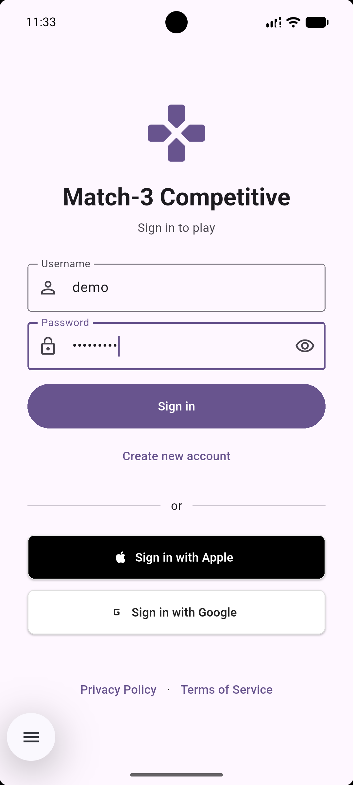
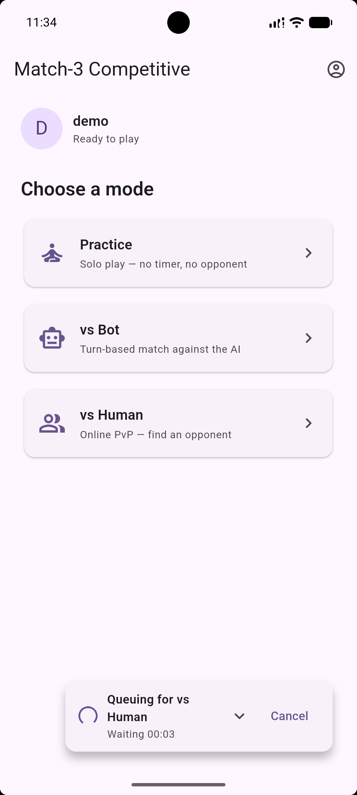
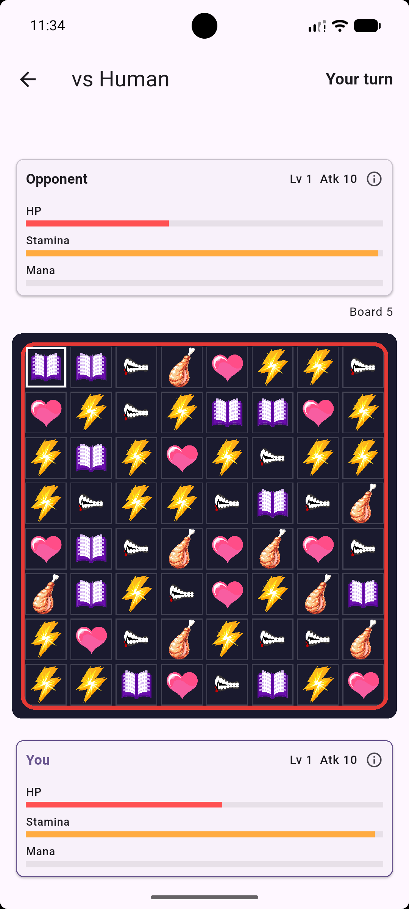
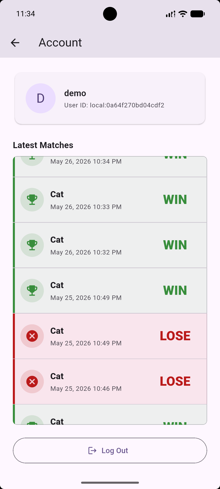

# Match3 Competitive

Match3 Competitive is a production-oriented, cross-platform Flutter game client for real-time match-3 competition. It supports solo practice, bot matches, and authenticated human matchmaking through a backend-driven online mode.

The project is built to demonstrate user-facing application engineering: native mobile/web UI, real-time networking, local persistence, typed API boundaries, reconnect-safe gameplay, and a test suite that covers both game logic and critical user flows.

## Screenshots

<p>
  
  
  
  
</p>

## What in this repo

- Cross-platform application development with Flutter for Android, iOS, and web.
- User-facing product flows: sign in, registration, character selection, matchmaking, account screen, match history, and result screens.
- Real-time multiplayer architecture using REST APIs for session/match orchestration and Socket.IO WebSockets for board updates.
- Production-style reliability work: room tokens, reconnect/resume flows, board hash desync recovery, no-legal-move board replacement, typed error handling, and local session restore.
- Modular game engineering: pure Dart match-3 engine, Flame-powered board rendering, network clients, services, models, screens, and backend protocol DTOs separated by responsibility.
- Practical testing discipline with 20 Flutter test files and 137 widget/unit/service tests.

## Architecture

```text
Flutter app
  Screens + Router
    |-- auth, lobby, account, character select, game, result
  Services
    |-- REST clients for auth, account, matchmaking, match history
    |-- SharedPreferences for session restore and local preferences
  Net
    |-- Socket.IO clients for matchmaking and board-delta gameplay streams
  Game
    |-- pure Dart board/judge/legal-move logic
    |-- Flame match board rendering

Backend stack
  Node.js + Socket.IO + PostgreSQL
    |-- session tokens over HTTP
    |-- room tokens over WebSocket handshake
    |-- server-authoritative online match state
    |-- Docker Compose deployment for frontend, backend, and database
```

State is intentionally framework-light: local screen state, `ChangeNotifier` for auth/router integration, Dart `Stream`s for auth and WebSocket events, and `SharedPreferences` for persisted session and character preference data. This keeps the app easy to inspect while still exercising the same concerns found in Bloc/Riverpod/Provider apps: state ownership, lifecycle management, async orchestration, and recovery from network events.

## Technology

| Area | Implementation |
|---|---|
| Client | Flutter, Dart, Material UI, GoRouter |
| Game rendering | Flame |
| Local game logic | Pure Dart board model, judge, generator, legal move detection |
| APIs | REST-style HTTP clients with injectable request functions |
| Real-time | Socket.IO over WebSockets, typed event DTOs, reconnect/resume handling |
| Persistence | SharedPreferences on the client; PostgreSQL on the backend |
| Backend | Node.js, TypeScript, Socket.IO, PostgreSQL |
| Deployment | Docker Compose with separate frontend, backend, and database services |
| Testing | Flutter widget/unit/service tests; backend Vitest unit/integration tests |

## Engineering Highlights

- API orchestration across auth, matchmaking, account deletion, match history, active-session lookup, and online-match resume.
- Streaming gameplay events for `match_found`, `move_resolved`, `board_replaced`, `turn_changed`, `swap_fizzled`, `skill_rejected`, and `game_over`.
- Reconnect-safe online play: the client can request a fresh room token, reconnect, and continue from server-authored match state.
- Latency and desync work in the backend test harness: simulated RTT scenarios, no-desync assertions, and reconnect-to-resume checks.
- Accessibility-focused UI testing for keyboard traversal, reduced motion routing, focus order, and long-scroll screens.
- Testable networking via injectable HTTP functions and fake socket clients.

## Try The Android APK

The Android APK is published in the [GitHub Releases](https://github.com/BuiHoangTu/match3-competitive-fe/releases/latest) for this repository or the apk directly here:
<https://github.com/BuiHoangTu/match3-competitive-fe/releases/download/0.10.0/app-release.apk>

1. Download `app-release.apk` from the latest release on an Android device.
2. Install the APK. If Android blocks it, allow installs from your browser or file manager when prompted.
3. Open the app and sign in with:

```text
Username: demo
Password: 123456abc
```

4. Try the core flow:
   - Choose `Practice` for a local match.
   - Choose `vs Bot` for backend-assisted play.
   - Choose `vs Human` to enter matchmaking.
   - Open `Account` to review profile and match-history behavior.

You can also install the downloaded APK from a computer:

```bash
adb install -r app-release.apk
```
