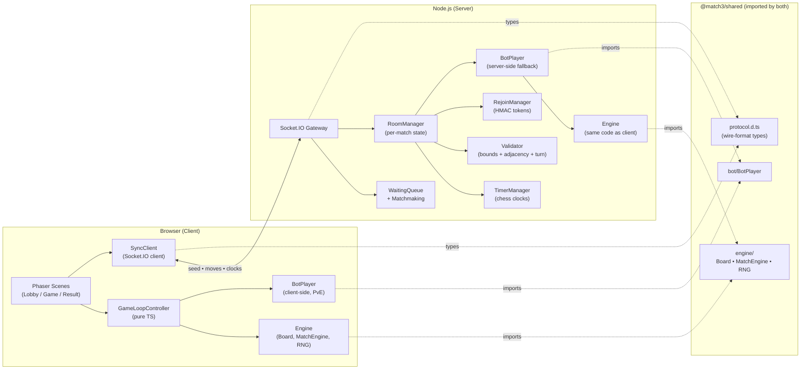
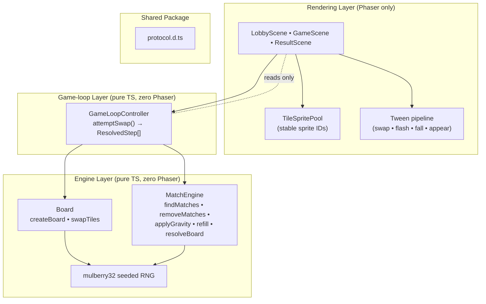
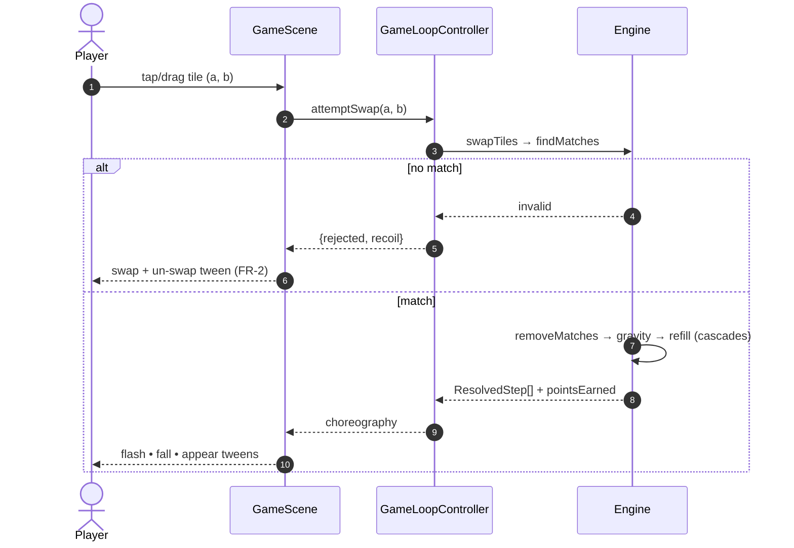
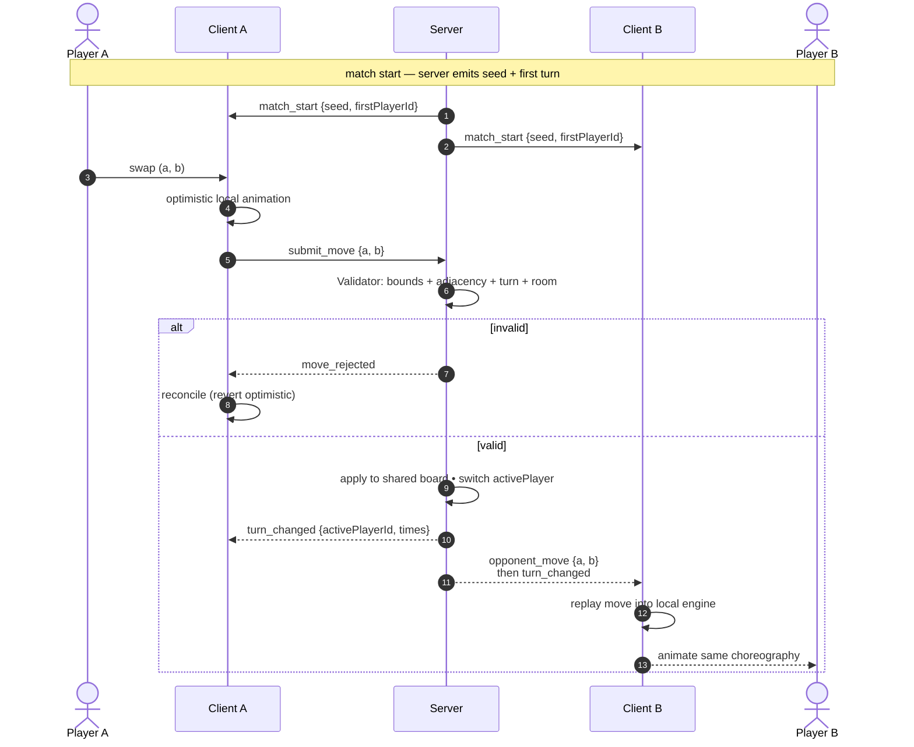
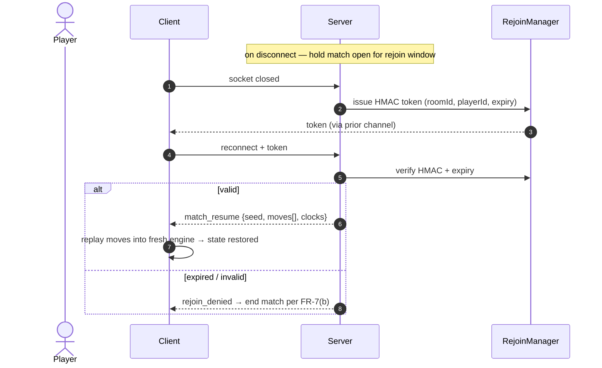
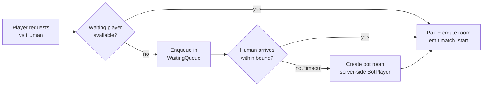
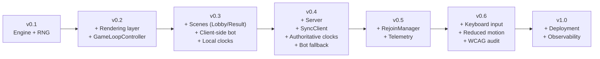
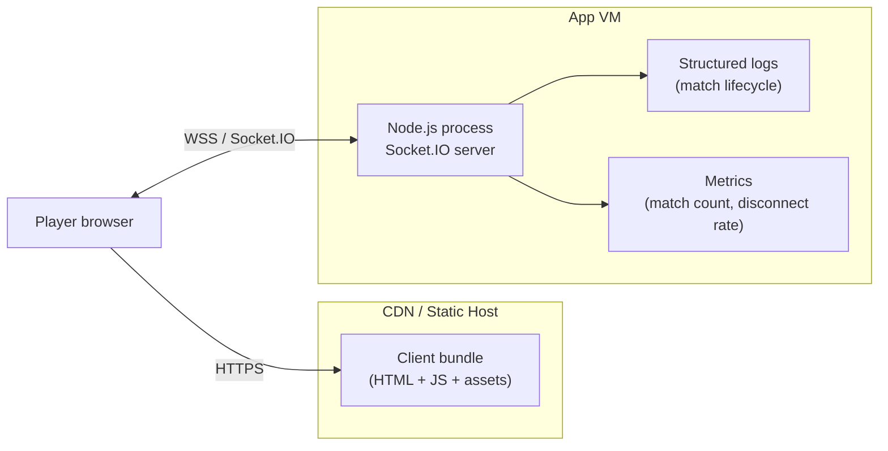

# System Design

Companion to [planning.md](planning.md) and [requirement.md](requirement.md). This document turns the milestone plan into a concrete architecture: component boundaries, data flow across the wire, and deployment shape. Diagrams are authored in Mermaid so they render directly on GitHub and in most Markdown viewers.

- **Scope.** Logical architecture of the game client, the server, and the shared code they both import. Runtime data flow for the three gameplay modes ([FR-5](requirement.md#1-functional-requirements--gameplay--modes)). Deployment topology for v1.0.
- **Non-scope.** Tile art specification, DevOps runbooks, accounts/persistence (out per [problem-definition.md § 6](problem-definition.md#6-non-goals-out-of-scope-for-this-specification)).

---

## 1. Architectural principles

These principles derive from the plan's guiding rules ([planning.md § 1](planning.md#1-guiding-principles)) and drive every layering decision below.

| Principle | Architectural consequence |
|---|---|
| Determinism before network ([NFR-5](requirement.md#determinism), [MR-2](requirement.md#2-multiplayer--networking-requirements)) | Engine is a pure library with zero framework/Node/Phaser imports. All randomness flows through one seeded RNG. Engine is unit-testable headlessly. |
| Bot before human | Bot AI is a pure function over board state, shared between the client (PvE) and the server (matchmaking fallback). The online flow is a transport swap over the same turn loop, not a re-implementation. |
| Ship playable slices | Every version after v0.1 boots a real UI. No "infrastructure-only" releases means no long-lived hidden branches. |
| Accessibility is not a bolt-on ([NFR-7](requirement.md#accessibility), [NFR-8](requirement.md#accessibility)) | Tile identity is encoded as shape + colour from v0.2. Input is abstracted behind a device-agnostic interface so keyboard support in v0.6 is additive. |
| Minimal wire protocol ([MR-3](requirement.md#2-multiplayer--networking-requirements), [MR-8](requirement.md#2-multiplayer--networking-requirements)) | The server relays seed + moves + clocks only. Full-state messages exist solely for the rejoin path ([MR-6](requirement.md#2-multiplayer--networking-requirements)). Board snapshots never appear in the hot path. |

---

## 2. High-level architecture

Two processes communicate over Socket.IO. Both import the same deterministic engine from a shared package, which is why the server can validate every move and the bot can play on the real board.

The shared package is the keystone: if the engine code drifted between client and server, [MR-2 / NFR-6](requirement.md#determinism) would be unenforceable. Keeping one source of truth — imported by both sides — makes determinism a compile-time property rather than a runtime hope.

---

## 3. Layered component view (client)

The client is four strict layers. Arrows only point down — upper layers depend on lower, never the reverse. This is what makes the engine unit-testable in Node and what keeps render code from accidentally mutating game state.

**Why the separation.** `GameLoopController` owns the tile-ID grid (`idAt`) and the choreography data (`ResolvedStep[]`). `GameScene` reads that choreography and drives tweens; it never mutates the board. That one-way contract is what lets the animation code be rewritten without touching game logic, and it's what makes v0.2 (rendered practice) a pure additive layer on top of v0.1 (headless engine).

---

## 4. Runtime data flow

### 4.1 Local move (Practice / PvE)

No network involvement. The scene is the I/O driver; the controller runs the engine synchronously and returns a choreography plan; the scene animates it.

### 4.2 Online move (vs Human) — the transport change from v0.3 → v0.4

Local move UX is unchanged; only the submit-and-confirm edges differ. The server is authoritative for turn order ([MR-4](requirement.md#2-multiplayer--networking-requirements)) and clocks ([MR-5](requirement.md#2-multiplayer--networking-requirements)); it relays a validated move to both clients so each replays it into its local engine.

Key property: the wire carries `(a, b) + metadata` only. Both clients reach cell-identical state because they run the same engine on the same seed with the same ordered moves — which is exactly what [NFR-6](requirement.md#determinism) requires.

### 4.3 Reconnection (v0.5, [MR-6](requirement.md#2-multiplayer--networking-requirements))

The rejoin path is the one place full-state crosses the wire, and only to one recipient. A signed token binds the session to the room so a stranger can't hijack it.

### 4.4 Matchmaking with bot fallback ([MR-1](requirement.md#2-multiplayer--networking-requirements))

The bot fallback reuses the same `RoomManager` pipeline as a human match. From the client's perspective the two flows are indistinguishable — which is exactly why v0.3 (local bot) generalises cleanly to v0.4 (server with bot fallback).

---

## 5. Mapping to the milestone plan

Each version in [planning.md § 2](planning.md#2-milestones--per-version-scope) corresponds to a specific subset of this architecture. No component comes online before its version; nothing lingers half-built.

| Version | New components introduced | Requirements satisfied |
|---|---|---|
| v0.1 | `shared/engine/` (Board, MatchEngine, RNG) | FR-1, FR-3, FR-4, NFR-5, NFR-6 |
| v0.2 | `fe/scenes/GameScene` (solo), `fe/game/GameLoopController`, `fe/rendering/TileSpritePool` | FR-2, FR-5 (Practice), NFR-1, NFR-2, NFR-7, NFR-8 (mouse/touch) |
| v0.3 | `fe/scenes/LobbyScene`, `fe/scenes/ResultScene`, `shared/bot/BotPlayer`, local `TimerManager` | FR-5 (vs Bot), FR-6, FR-7 |
| v0.4 | `be/server`, `be/RoomManager`, `be/WaitingQueue`, `be/Validator`, `be/TimerManager`, `be/BotManager`, `fe/net/SyncClient`, `shared/protocol.d.ts` | FR-5 (vs Human), FR-8, MR-1–5, MR-7, MR-8 |
| v0.5 | `be/RejoinManager`, latency harness, lifecycle logging | MR-6, NFR-3, NFR-4 |
| v0.6 | Keyboard input adapter, `prefers-reduced-motion` path | NFR-8 (keyboard), NFR-9, NFR-10, NFR-11, NFR-12 |
| v1.0 | Hosting + TLS + metrics | — (infra) |

---

## 6. Deployment topology (v1.0)

A single small VM carries the closed beta per [planning.md § 4.5](planning.md#45-non-engineering-support). The static client and the realtime server can co-reside or split; splitting is straightforward because the client has no build-time dependency on the server origin beyond a Socket.IO URL.

**Scaling notes.** With determinism and a tiny wire protocol, one process comfortably holds the closed-beta target. Horizontal scaling, when needed, is a sticky-session or room-affinity routing problem — not a state-sync problem, because each room is self-contained in memory and can be reconstructed from its seed + move log.

---

## 7. Technology stack

| Layer | Choice | Why |
|---|---|---|
| Game client | Phaser 3.88 + TypeScript 5.8 + Vite 6 | Mature 2D framework; Vite keeps [NFR-12](requirement.md#platform--access) (zero-friction entry) viable via fast cold loads. |
| Shared engine | Pure TypeScript (no deps) | Imported by fe and be; satisfies [NFR-5](requirement.md#determinism) by construction. |
| Backend | Node.js + Socket.IO 4.7 | Same language as client → one engine, zero porting. Socket.IO handles reconnection plumbing that [MR-6](requirement.md#2-multiplayer--networking-requirements) needs. |
| Tests | Vitest (fe + be) | Node-runnable; engine tests need no browser. |
| Mobile (future) | Capacitor | Deferred; browser-first per [problem-definition.md § 6](problem-definition.md#6-non-goals-out-of-scope-for-this-specification). |

---

## 8. Cross-cutting concerns

**Determinism checks.** Two independent unit tests guard [NFR-5/NFR-6](requirement.md#determinism): a seeded-RNG byte-equality test, and a move-replay test that asserts two engines given the same seed + move list produce the same final board. The latter also runs end-to-end in v0.4 across two browser instances.

**Bandwidth budget ([MR-8](requirement.md#2-multiplayer--networking-requirements)).** A move message is ≲ 40 bytes including Socket.IO framing. A 5-minute match with ~2 moves/sec and one clock tick/sec is on the order of a few kilobytes. Snapshots are off the hot path, so there is no regression surface beyond "accidentally add a new event in the move flow."

**Failure modes.**
- *Client crash mid-move* — state is recoverable because the server holds the authoritative move log; reconnect replays it.
- *Server crash* — match ends per [FR-7(b)](requirement.md#1-functional-requirements--gameplay--modes). Persistent-match recovery is out of scope until accounts exist.
- *Determinism divergence* — treated as a critical bug per [NFR-6](requirement.md#determinism). The two-browser assertion in v0.4 is the guardrail.

**Security posture.** No accounts means no credentials to steal. Move validation on the server ([MR-7](requirement.md#2-multiplayer--networking-requirements)) defeats client tampering. Rejoin tokens are HMAC-signed with a server-side secret ([MR-6](requirement.md#2-multiplayer--networking-requirements)) so a stolen socket id cannot rejoin someone else's match.

---

## 9. Open questions (blocking pinning in [requirement.md § Open values](requirement.md#open-values))

These values shape architecture only when they move materially (e.g. a 16×16 grid changes sprite-pool sizing; a 30-minute clock changes timer-tick cadence). The suggested starts in requirement.md are safe for the current architecture; revisit if changed.

- Grid size & palette count — affects sprite pool presizing and tile-art deliverables.
- Per-player clock — affects reconnect-window ergonomics (window should be ≪ clock).
- Reconnection window — affects server memory residency per idle match.
- Concurrent-match target — blocks v1.0 load-test design and VM sizing.

---

## 10. Document status

Living document. Update when a component is added, moved between layers, or when a requirement changes in [requirement.md](requirement.md). Do not renumber existing sections; append deprecation notes instead.
