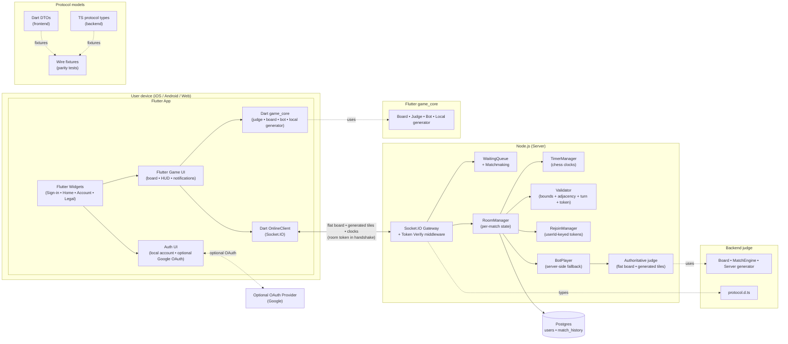
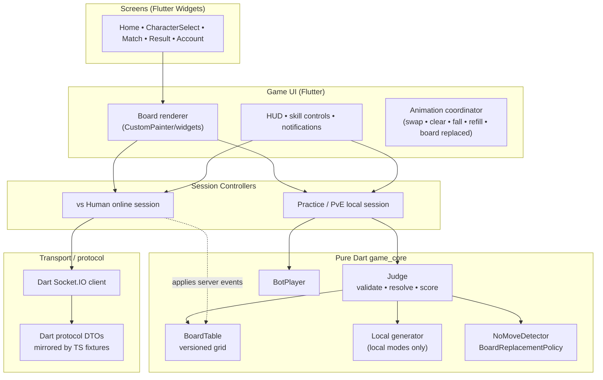
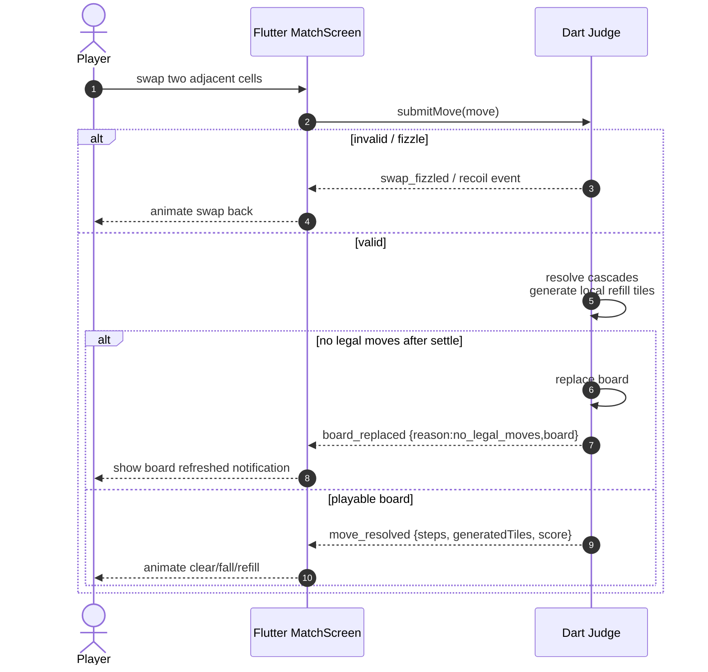
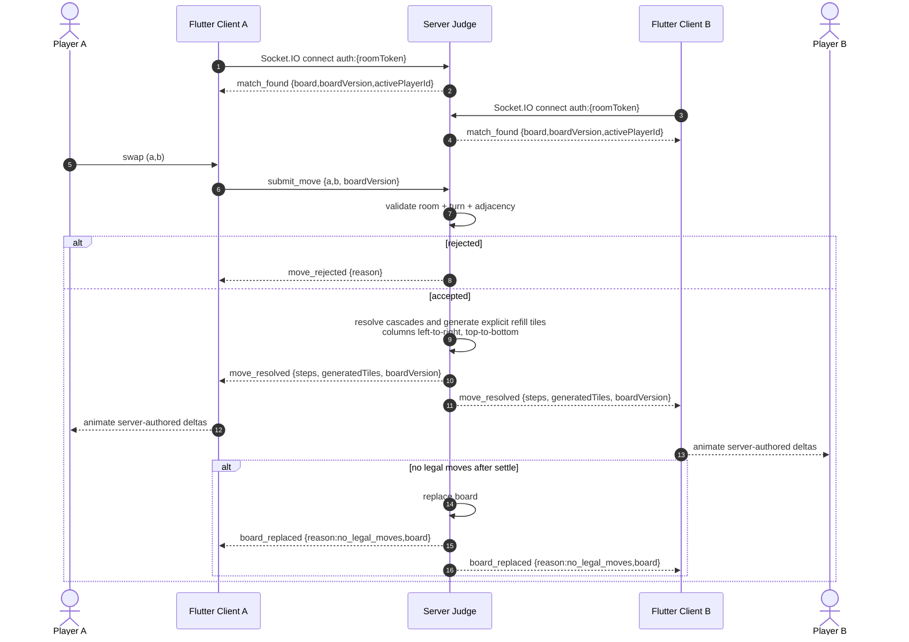
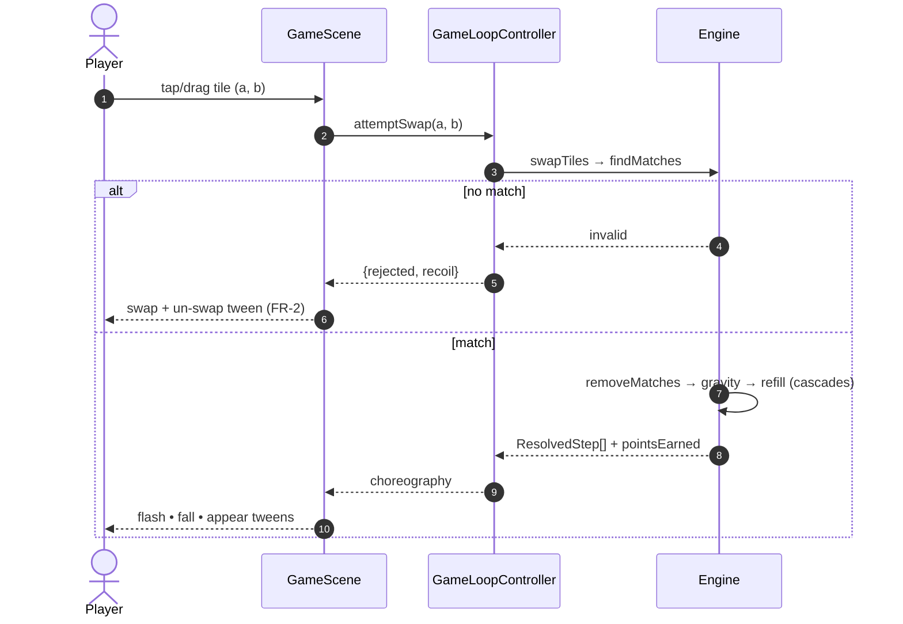
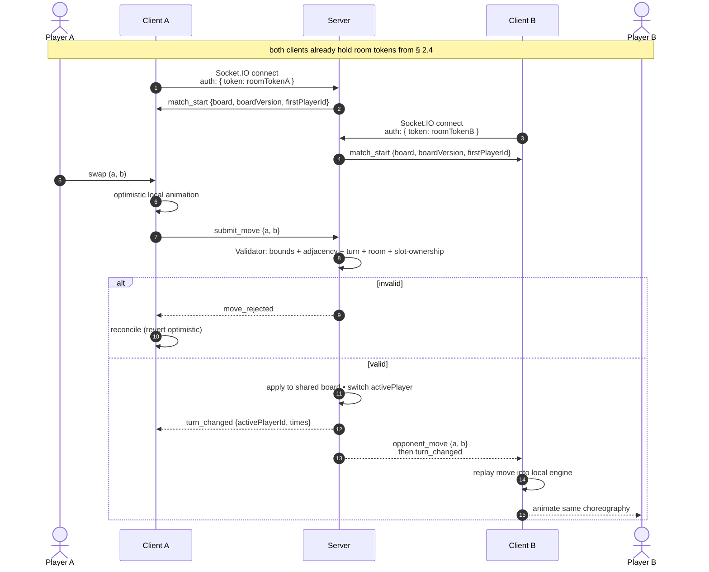
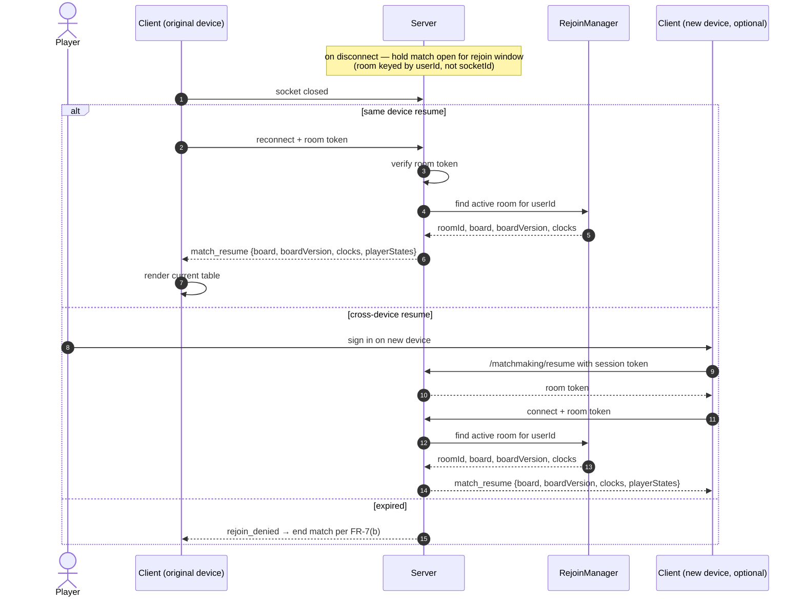
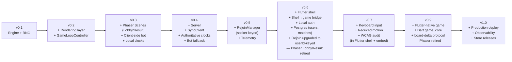
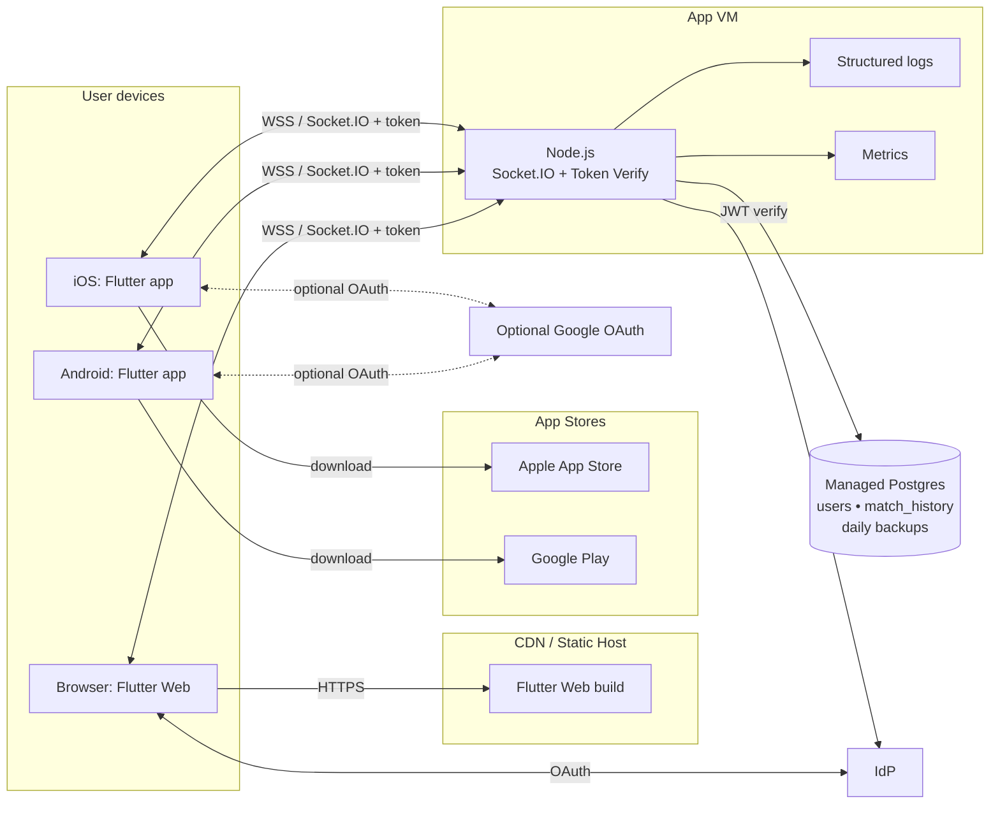

# System Design

Companion to [planning.md](planning.md) and [requirement.md](requirement.md). This document turns the milestone plan into a concrete architecture: component boundaries, data flow across the wire, and deployment shape. Diagrams are authored in Mermaid so they render directly on GitHub and in most Markdown viewers.

- **Scope.** Logical architecture of the Flutter app, the game library, the server, the identity provider, and the server/client gameplay protocol. Runtime data flow for the three gameplay modes ([FR-5](requirement.md#1-functional-requirements--gameplay--modes)) plus sign-in and cross-device rejoin. Deployment topology for v1.0.
- **Non-scope.** Tile art specification, DevOps runbooks, localisation, push/IAP (the shell has the plumbing but not the features, per [planning.md § 6](planning.md#6-what-this-plan-does-not-cover)).

## 0. 2026-05-11 architecture pivot

The current target is a **full Flutter game client** backed by a pure Dart game-core library. The Phaser/Vite embedded game view, WebView/iframe wrapper, and shell-to-game bridge are legacy implementation details to be removed during the migration tracked in [flutter-native-migration.md](flutter-native-migration.md).

This pivot also changes networking: online clients no longer receive or replay a shared seed. In **vs Human**, the server sends the current board table as a flat row-major array at match start/rejoin and sends board-delta packets containing explicit generated tiles for normal moves. Board dimensions are shared constants, not wire fields. If no legal moves exist after a settled board, the server emits a full-board replacement event and the Flutter client shows a notification. In **Practice** and **vs Bot**, a local Dart authoritative judge/generator owns the board. Competitive modes do not use point scores.

---

## 1. Architectural principles

These principles derive from the plan's guiding rules ([planning.md § 1](planning.md#1-guiding-principles)) and drive every layering decision below.

| Principle | Architectural consequence |
|---|---|
| Authority before rendering ([NFR-5](requirement.md#determinism), [MR-2](requirement.md#2-multiplayer--networking-requirements)) | Game rules live in pure libraries. Online randomness and board state are server-authored; local modes use the Dart judge. UI code never invents generated tiles. |
| Bot before human | Bot AI is a pure function over board state, shared between the client (PvE) and the server (matchmaking fallback). The online flow is a transport swap over the same turn loop, not a re-implementation. |
| Ship playable slices | Every version after v0.1 boots a real UI. No "infrastructure-only" releases means no long-lived hidden branches. |
| Accessibility is not a bolt-on ([NFR-7](requirement.md#accessibility), [NFR-8](requirement.md#accessibility)) | Tile identity is encoded as shape + colour from v0.2. Input is abstracted behind a device-agnostic interface so keyboard support in v0.6 is additive. |
| Board-delta wire protocol ([MR-3](requirement.md#2-multiplayer--networking-requirements), [MR-8](requirement.md#2-multiplayer--networking-requirements)) | The server sends flat row-major board tables at match start/rejoin/replacement and generated tile arrays during normal move resolution. Server and client share the same board dimensions and refill consumption order. Clients animate server-authored deltas; they do not replay seeds. |
| Identity in Flutter ([AR-1](requirement.md#3-identity--account-requirements), [AR-3](requirement.md#3-identity--account-requirements)) | The Flutter app owns sign-in, token refresh, matchmaking, socket connection, lifecycle handling, and gameplay rendering. No WebView bridge is part of the target architecture. |
| Flutter replaces, does not wrap | The product is a Flutter app with Flutter-native gameplay. Phaser is retired rather than embedded. |

---

## 2. High-level architecture

Three processes: the Flutter app (on the user's device), the Node.js server, and optional OAuth providers. Flutter renders gameplay directly and uses a pure Dart game-core library for local Practice / vs Bot. Online vs Human uses a Dart Socket.IO client and consumes server-authored board tables/deltas.



Two things to notice in this picture:

1. **The hot path is Flutter-native.** Gameplay input, animation, HUD, notifications, and socket events live in the Flutter app. There is no platform-channel bridge between shell and game.
2. **The server is the online board authority.** Online clients consume board tables and generated-tile arrays. Local modes use the Dart judge so they remain responsive offline and do not need a server room.

### 2.1 Flutter client and game core

One Flutter codebase targets three platforms. The game board is rendered by Flutter, and local rules live in a pure Dart library with no Flutter imports.

| Target | Runtime | Gameplay rendering | Network |
|---|---|---|---|
| iOS | Flutter (Dart) compiled to native | Flutter widgets / CustomPainter | Dart Socket.IO client |
| Android | Flutter (Dart) compiled to native | Flutter widgets / CustomPainter | Dart Socket.IO client |
| Flutter Web | Flutter (Dart) compiled to JS/Wasm where available | Flutter widgets / CustomPainter | Dart Socket.IO client |

Responsibilities split cleanly:

- **Flutter app owns:** sign-in UI, token acquisition/refresh, account deletion UI, privacy/ToS screens, lobby/home screen, character selection, match screen, result screen, platform lifecycle detection, socket connection, and all gameplay rendering.
- **Dart game_core owns:** local board state, match resolution, no-legal-move detection, local generation, local bot decisions, and event packets for Practice/vs Bot.
- **Server owns for vs Human:** flat board table, generated tiles, turn ownership, clocks, player states, rejoin snapshots, and match end. Board dimensions are agreed constants.

The reason for this split: the latency-sensitive loop ([NFR-2](requirement.md#performance), [NFR-3](requirement.md#performance)) should stay in one Flutter runtime. Local modes do not wait for the server; online mode does not trust the client for board generation.

### 2.2 Legacy shell→game bridge contract

This section describes the legacy v0.6 implementation only. The target Flutter-native architecture has no shell→game bridge. See [flutter-native-migration.md](flutter-native-migration.md) for removal steps.

**Shell → game (shell-initiated):**
- `startMatch(roomToken: string, expiresAt: number)` — called after the shell has obtained a room-scoped token from the matchmaking endpoint (§ 2.4). Game view stores the token and connects the Socket.IO handshake with it. Older builds treated the token as opaque; the target token payload is `{roomId, userId, slot, exp}` and carries no board seed.
- `appLifecycle(state: "foreground" | "background" | "pause" | "resume")` — allows the game view to pause animations and timers during background, and to trigger a reconnect probe on resume.
- `requestLeaveMatch()` — user tapped "leave match" in the shell UI; game view should gracefully end the current match.

**Game → shell (game-initiated):**
- `matchEnded(outcome: "W" | "L" | "D")` — shell shows the result screen in native Widgets and a "play again" button. Legacy builds may include scores, but v0.9 competitive result screens do not.
- `authTokenRejected()` — server rejected the room token (usually TTL-expired on a long match); shell re-requests a room token via the matchmaking endpoint's rejoin path and calls `startMatch` again.
- `ready()` — game view has loaded and is ready to receive the first `startMatch` call.

**Explicitly NOT on the bridge:** moves, clock ticks, opponent state, cascade events, board tables, generated tiles, seed, and room id. The legacy game view's socket owned gameplay traffic. App session tokens never cross the bridge; the game view only ever sees the server-issued room token.

### 2.3 Identity data flow

Two distinct tokens, two distinct roles. The **session token** proves who the user is and stays in the Flutter app's HTTP layer. The **room token** proves this user is entitled to a specific online match and is the credential used by the Flutter Socket.IO client.

- **Session token** — issued by our backend after local sign-in/register, or after a future approved OAuth exchange. Carries `{userId, kind:"session", exp}`. Used by Flutter to authenticate HTTP calls to matchmaking/account endpoints. Server verifies it locally with `LocalSessionSigner`.
- **Room token** — issued by *our server* after matchmaking succeeds. Short-lived (5 min, covers a match + slack). Carries `{roomId, userId, slot, exp}`. It does **not** carry a board seed. Signed with a server-side HMAC secret. Used by the Flutter Socket.IO client for the online handshake. Server verifies it with a local HMAC check.

```mermaid
sequenceDiagram
    autonumber
    actor U as User
    participant Shell as Flutter App
    participant FC as Flutter Client
    participant S as Server
    U->>Shell: sign in / register
    Shell->>S: POST /auth/login or /auth/register
    S-->>Shell: sessionToken + userId
    Note over Shell: sessionToken stays in HTTP layer;<br/>not sent over Socket.IO
    U->>Shell: tap "Find match"
    Shell->>S: POST /matchmaking/join<br/>Authorization: Bearer sessionToken
    S->>S: verify local session token
    S->>S: enqueue in WaitingQueue<br/>(long-poll up to BOT_WAIT_MS)
    S->>S: match found → create room<br/>sign roomToken {roomId, userId, slot, exp}
    S-->>Shell: 200 { roomToken, expiresAt }
    Shell->>FC: store roomToken for match screen
    FC->>S: Socket.IO connect<br/>auth: { token: roomToken }
    S->>S: verify HMAC locally → decode {roomId, slot}
    S->>FC: place in room<br/>emit match_found {board,boardVersion,activePlayerId}
    Note over Shell,FC: Later — room token nears expiry during a long match
    FC->>S: next move (stale token)
    S-->>FC: auth_token_rejected
    Shell->>S: POST /matchmaking/resume<br/>Authorization: Bearer sessionToken<br/>body: { roomId }
    S-->>Shell: 200 { roomToken, expiresAt } (new)
    FC->>S: reconnect with fresh room token
```

The "token refresh while connected" flow is the subtle part and is explicitly tested in v0.6 — if it is broken, long matches drop on the token TTL boundary. Critically, refreshing or restoring the app session token does NOT trigger a new `startMatch` — the room token is independent of session-token expiry.

### 2.4 Matchmaking endpoint

A small HTTP surface on the same Node server that owns the Socket.IO gameplay. Kept separate from the socket because (a) matchmaking is request/response, not streaming, and (b) the shell should not need a persistent socket just to find a game.

**`POST /matchmaking/join`**
- Auth: `Authorization: Bearer <sessionToken>`
- Body: `{ mode: "turn_based" | "pve", characterId?: string }`. Practice is local and does not create a server room.
- Behaviour: long-poll up to `BOT_WAIT_MS` (5 s). If a human is waiting for the same mode, pair them. Otherwise fall back to a bot room. In either case, create the room, sign a room token, and return.
- Response (200): `{ roomToken: string, expiresAt: number, mode, opponent?: { displayName } }`
- Errors: 401 invalid/missing session token; 409 user already in an active match (AR-7); 503 shutdown draining.

**`POST /matchmaking/resume`**
- Auth: `Authorization: Bearer <sessionToken>`
- Body: `{ roomId: string }`
- Behaviour: if the caller's userId matches a slot in an existing open room (inside the rejoin window per MR-6), sign a fresh room token for that room. Otherwise return 410 Gone so the shell knows to route to home.
- Response (200): `{ roomToken, expiresAt }`
- Errors: 401 invalid session token; 403 userId not a slot in this room; 410 room closed/timed-out.

**Room token format** (opaque to the game view, structured for the server):
```
roomToken = HMAC-SHA256(secret, base64url(header) + "." + base64url(payload))
payload = { roomId, userId, slot: 0|1, iat, exp }
```

TTL is 5 minutes by default — long enough for a normal match plus turn timers, short enough to bound damage if leaked. The token is bearer-style; possession of it = rights to the match slot. Leaks are mitigated by (a) TLS transport, (b) short TTL, (c) binding to a specific userId slot (a stolen token still can only play *as that user*, cannot steal identity). The token is not a board-state input.

---

## 3. Layered component view (Flutter-native target)

Inside the Flutter app, layers point down — UI depends on game-core and network services, never the reverse. The pure Dart game-core layer has no Flutter imports, which keeps local Practice/vs Bot logic testable without widgets.



**Legacy note.** The current repository still contains the old `packages/game-view` Phaser stack while the migration is pending. Treat it as legacy unless a task explicitly says to patch it.

## 4. Runtime data flow

### 4.1 Practice move (local Dart judge)

Practice is local, score-only, and endless until the player leaves.



### 4.2 Online move (vs Human)

The server is authoritative. The client does not generate refill symbols and does not replay a seed.



### 4.3 Local vs Bot

vs Bot uses the same Dart judge as Practice plus a local bot player and local turn clock. It does not create a gameplay server room. A future persistence endpoint may receive a match summary after completion for history/XP, but server-side gameplay validation is not involved.

### 4.4 Legacy runtime data flow

The following subsections describe the pre-migration Phaser/WebView design. They remain useful only while comparing old behaviour during implementation. The target flow is § 4.1-4.3 and [flutter-native-migration.md](flutter-native-migration.md).

### 4.4.1 Local move (legacy Practice / PvE)

No network involvement. The scene is the I/O driver; the controller runs the engine synchronously and returns a choreography plan; the scene animates it.



### 4.4.2 Online move (legacy vs Human) — the transport change from v0.3 → v0.4

Local move UX is unchanged; only the submit-and-confirm edges differ. The server is authoritative for turn order ([MR-4](requirement.md#2-multiplayer--networking-requirements)) and clocks ([MR-5](requirement.md#2-multiplayer--networking-requirements)); it relays a validated move to both clients so each replays it into its local engine.

From v0.6 onward, by the time either client's socket connects it already carries a room token that names its `roomId` and `slot`. The server decodes the token at handshake and places the socket in its room atomically — there is no client-side `join_queue` event. The game view's first observable socket message is `match_start` for its room.



Legacy key property: the wire carries `(a, b) + metadata` only and clients replay seed + moves. This is superseded by server-authored board tables and generated-tile arrays.

### 4.5 Reconnection ([MR-6](requirement.md#2-multiplayer--networking-requirements))

The rejoin path sends current authoritative state to the reconnecting Flutter client: flat board table, board version, active player, player states, and clocks. It does not send seed + move history as the primary restore path.



The v0.5 rejoin implementation used an HMAC token keyed by `(roomId, socketId, expiry)` — fine for tab-refresh recovery, useless for device-switching because a new device has a new socket id. The v0.6 upgrade replaces that with "room is keyed by authenticated userId; rejoin is whoever presents a valid app session token for that userId within the window." The old rejoin HMAC disappears because session-token verification already provides the hijack resistance it gave.

### 4.6 Matchmaking with bot fallback ([MR-1](requirement.md#2-multiplayer--networking-requirements))

From v0.6, matchmaking is an HTTP request/response against `/matchmaking/join` (§ 2.4) rather than a socket event. Waiting happens inside the server holding the request open; the shell sees a single synchronous answer containing a signed room token.

```mermaid
flowchart LR
    In[Flutter POST<br/>/matchmaking/join<br/>+ session token] --> Verify[AuthMiddleware<br/>verify session]
    Verify --> Q{Waiting player<br/>available for mode?}
    Q -- yes --> Pair[Pair + create room]
    Q -- no --> Wait[Hold request<br/>long-poll BOT_WAIT_MS]
    Wait --> T{Human arrives<br/>within bound?}
    T -- yes --> Pair
    T -- no, timeout --> BotRoom[Create bot room<br/>server-side BotPlayer]
    BotRoom --> Pair
    Pair --> Sign[Sign roomToken<br/>HMAC + claims]
    Sign --> Resp[200 OK<br/>to shell]
    Resp --> Match[Flutter match screen<br/>stores roomToken]
    Match --> Sock[Flutter Socket.IO connect<br/>with roomToken]
    Sock --> Start[Server emits<br/>match_found {board}]
```

The bot fallback reuses the same `RoomManager` pipeline as a human match. From the client's perspective the two flows are indistinguishable — which is exactly why v0.3 (local bot) generalises cleanly to v0.4 (server with bot fallback). The shell receives the same `roomToken` shape regardless of opponent type.

---

## 4.5 Characters, skills, progression (v0.8)

Characters introduce per-player base stats and a skill system on top of the existing tile-effect engine. The architecture extends the existing pattern (server-authoritative for `turn_based`; client-deterministic-with-server-relay for pve) — no new processes.

```
shared-js/
  character/
    CharacterDef.ts   — CharacterDef + Skill + SkillEffect (discriminated union of stat-change /
                         activate-tiles / move-tiles primitives) + AmountExpr + TileSelector. Pure types.
    cat.ts            — first concrete character ("scratch", "strong bite", "board strike"),
                         expressed as effect lists.
    registry.ts       — id → CharacterDef map; iteration order is stable.
  engine/
    PlayerStats.ts    — extended: scaledStats(base, level), levelFromXp(xp), xpToNext(level)
    MatchEngine.ts    — extended: returns extraTurnsFromMatch4Plus per cascade step

apps/backend/
  persistence/UserProgressStore.ts   — read/write (userId, xp, defaultCharacterId)
  services/MatchEngineService.ts     — accepts characterId per slot at startMatch;
                                        applies skills (consume mana, deal damage, heal);
                                        suppresses turn switch when extraTurns > 0;
                                        awards XP at match-end and emits level_up mid-match.
  handlers/skill.ts                  — socket.on("skill", { skillId, target })
```

### 4.5.1 Wire additions

- `MatchFoundPayload` carries `characters: { [playerId]: characterId }` so each client renders the right portrait + skill set.
- `move_resolved` and `turn_changed` extend with `extraTurnsRemaining: number` (the active player's cumulative pending extra turns from 4+ matches; turn does not switch while > 0).
- New event `skill_resolved { playerId, skillId, damageDealt, healedAmount, activatedCells, playerStates }` — broadcast to room when a skill resolves.
- New event `level_up { playerId, newLevel, playerStates }` — broadcast when an XP grant crosses a threshold mid-match.
- New event `xp_awarded { playerId, xpDelta, newXp, newLevel }` — emitted alongside `match_ended`.

### 4.5.2 Authority and determinism

Skill damage and stat scaling MUST be computed server-side for `turn_based` and `pve` (whose end-of-match flow already routes through `match_complete`). Solo can compute locally since there's no opposing player. The 4+-line "extra turn" rule is a pure function of the cascade step's matched cells; clients and server compute it identically from the engine's match output. Mid-match level-ups are a deterministic function of (current xp + xp-from-this-match) crossing a threshold; the server is the announcer to keep both clients in sync.

### 4.5.3 Persistence

A new table `user_progress (user_id PK, xp INT NOT NULL DEFAULT 0, default_character_id TEXT NOT NULL, updated_at TIMESTAMPTZ)` is added to Postgres. The account-deletion sweep (AR-4) MUST drop the corresponding row. Competitive match-history rows are unchanged by v0.9 except that point scores are no longer required by the target product.

---

## 5. Mapping to the milestone plan

Each version in [planning.md § 2](planning.md#2-milestones--per-version-scope) corresponds to a specific subset of this architecture. No component comes online before its version; nothing lingers half-built.



| Version | New components introduced | Requirements satisfied |
|---|---|---|
| v0.1 | `shared/engine/` (Board, MatchEngine, RNG) | FR-1, FR-3, FR-4, NFR-5, NFR-6 |
| v0.2 | `fe/scenes/GameScene` (solo), `fe/game/GameLoopController`, `fe/rendering/TileSpritePool` | FR-2, FR-5 (Practice), NFR-1, NFR-2, NFR-7, NFR-8 (mouse/touch) |
| v0.3 | `fe/scenes/LobbyScene`, `fe/scenes/ResultScene`, `shared/bot/BotPlayer`, local `TimerManager` | FR-5 (vs Bot), FR-6, FR-7 |
| v0.4 | `be/server`, `be/RoomManager`, `be/WaitingQueue`, `be/Validator`, `be/TimerManager`, `be/BotManager`, `fe/net/SyncClient`, `shared/protocol.d.ts` | FR-5 (vs Human), FR-8, MR-1–5, MR-7, MR-8 |
| v0.5 | `be/RejoinManager` (socket-keyed), latency harness, lifecycle logging | MR-6 (initial), NFR-3, NFR-4 |
| v0.6 | `apps/frontend/` Flutter project (iOS + Android + Web targets), shell→game bridge, local auth integration, `be/AuthMiddleware` (session verify), Postgres + migrations (`users`, `match_history`), `RejoinManager` upgraded to userId-keyed. Phaser Lobby/Result scenes removed (replaced by Flutter Widgets). | AR-1–AR-7, NFR-11 (extended), MR-6 (upgraded) |
| v0.7 | Keyboard input adapter (shell + bridged into game view), `prefers-reduced-motion` handling in both, contrast audit | NFR-8 (keyboard), NFR-9, NFR-10, NFR-11 (formal), NFR-12 |
| v0.9 | Flutter-native game UI, pure Dart game_core, Dart online socket client, server board-delta protocol, no-legal-move board replacement, Phaser/WebView/bridge removal | MR-2, MR-3, MR-8, MR-9, NFR-5, NFR-6, NFR-11 |
| v1.0 | Hosting + CDN + TLS + managed Postgres + metrics + App Store / Play Store production releases | — (infra + store) |

---

## 6. Deployment topology (v1.0)

Three delivery paths (web, iOS, Android) share one server + one identity provider + one database. A single small VM with a managed Postgres can carry the closed beta per [planning.md § 4.5](planning.md#45-non-engineering-support). The Flutter app connects to the realtime server via Socket.IO; there is no separate embedded game bundle in the target topology.



**Scaling notes.** With per-room server authority, one process comfortably holds the closed-beta target. Horizontal scaling, when needed, is a sticky-session or room-affinity routing problem because each active room's board table lives in memory on one server process.

**Durable-state notes.** Identity and match history are the only durable data. `users` is tiny (one row per sign-in). `match_history` grows linearly with match completion — a few rows per player per session, each well under a kilobyte. A weekly backup + point-in-time recovery for the last 7 days is sufficient. No replication required for the closed beta.

**Store distribution.** Mobile builds ship as signed IPA / AAB through the App Store and Play Store. Gameplay code is compiled into the Flutter app. Flutter Web serves one Flutter build from the static host.

---

## 7. Technology stack

| Layer | Choice | Why |
|---|---|---|
| App client | Flutter + Dart (stable channel) | Single codebase for iOS, Android, and Web. Owns sign-in, navigation, online socket, and gameplay rendering. |
| Local game library | Pure Dart `game_core` | Local Practice/vs Bot judge, board generation, no-move detection, bot AI, and event models. No Flutter imports. |
| Legacy embedded game view | Phaser 3.88 + TypeScript 5.8 + Vite 6 | Present during migration only; removed before v0.9 is complete. |
| Backend | Node.js + Socket.IO 4.7 | Server-authoritative online flat board table, generated tiles, clocks, and player states. Socket.IO handles reconnection plumbing that [MR-6](requirement.md#2-multiplayer--networking-requirements) needs. |
| Identity | Local backend session tokens; optional future Google OAuth exchange | Google OAuth, if added, should exchange provider tokens with our backend for the same local session-token shape. |
| Persistence | Managed Postgres (production); SQLite acceptable for closed beta | Users + match history are small, well-structured, relational. No document-store fit. |
| Tests | Vitest (backend); Flutter `flutter_test` + integration tests | Backend protocol/judge tests; Dart game-core tests; Flutter widget/animation tests; protocol fixture parity tests. |

---

## 8. Cross-cutting concerns

**Board authority checks.** Online [NFR-5/NFR-6](requirement.md#determinism) checks assert that two Flutter clients applying the same server board packets reach the same flat board table/version as the server. Local Practice/vs Bot tests assert that the Dart judge never produces an unplayable board without emitting `board_replaced`.

**Bandwidth budget ([MR-8](requirement.md#2-multiplayer--networking-requirements)).** The new protocol sends more than seed+move replay because generated tiles are explicit. A hot-path move should still use ordered deltas and generated-tile arrays, not full board tables. Full flat board tables are reserved for match start, rejoin, no-legal-move replacement, and explicit reconciliation.

**Cold-load budget ([NFR-12](requirement.md#platform--access)).** Flutter Web no longer loads a second Phaser/Vite bundle after the shell. The main risk is Flutter renderer size plus game art assets. Measure cold-load after the Phaser bundle is removed.

**Failure modes.**
- *Client crash mid-move* — online state is recoverable because the server holds the authoritative board table/version; reconnect receives a board snapshot.
- *Token refresh miss* — if the room token expires, the next socket event is rejected. Flutter handles `auth_token_rejected`, calls `/matchmaking/resume`, and reconnects with a fresh room token.
- *Server crash* — live match ends per [FR-7(b)](requirement.md#1-functional-requirements--gameplay--modes). Completed-match rows in Postgres survive. Persistent-match recovery across server restarts is out of scope (too much complexity for the short-match product shape).
- *Database outage* — existing signed-in sessions can continue until token expiry; new local sign-in and durable writes may fail until DB recovers. Match-end writes are buffered in memory until DB recovers (bounded queue; drop oldest on overflow with a metric).
- *Board divergence* — treated as a critical bug per [NFR-6](requirement.md#determinism). The guardrail is boardVersion/boardHash reconciliation against server-authored packets.

**Security posture.**
- **Authenticated sessions.** HTTP matchmaking/account calls carry the app session token. Every Socket.IO handshake carries a server-issued room token verified locally with HMAC ([AR-3](requirement.md#3-identity--account-requirements), [MR-7](requirement.md#2-multiplayer--networking-requirements)).
- **Move validation.** Unchanged from v0.4: bounds + adjacency + turn ownership + room membership. Now includes "token userId matches the player slot in the room."
- **Rejoin hijack.** v0.5's HMAC-based rejoin token is retired in v0.6. Rejoin authority derives from presenting a valid auth token for the userId that owns the room — simpler, stronger, and requires no extra shared secret.
- **Data minimisation.** Only the sign-in provider's user id, display name, and avatar URL are stored server-side. No email addresses are stored unless the provider returns them as a required claim. Match history stores user ids, not names.
- **Deletion integrity ([AR-4](requirement.md#3-identity--account-requirements)).** Account deletion removes the `users` row and replaces the userId in all `match_history` rows with a tombstone identifier so the opponent's history remains self-consistent. Covered by an integration test.

**Privacy & compliance.** A privacy policy and terms-of-service are reachable from the sign-in screen ([AR-5](requirement.md#3-identity--account-requirements)). Account deletion is in-app and reachable without contacting support, satisfying App Store Guideline 5.1.1(v). If Google OAuth is offered on iOS, confirm whether Apple Sign-In is also required under the current App Store rules.

---

## 9. Open questions (blocking pinning in [requirement.md § Open values](requirement.md#open-values))

These values shape architecture only when they move materially (e.g. a 16×16 grid changes sprite-pool sizing; a 30-minute clock changes timer-tick cadence). The suggested starts in requirement.md are safe for the current architecture; revisit if changed.

- Grid size & palette count — affects sprite pool presizing and tile-art deliverables.
- Per-player clock — affects reconnect-window ergonomics (window should be ≪ clock).
- Reconnection window — affects server memory residency per idle match; the v0.6 jump from 60 s to ~5 min raises per-room residency ~5×.
- Concurrent-match target — blocks v1.0 load-test design and VM sizing.
- Account deletion grace period (immediate vs 30-day soft-delete) — affects the [AR-4](requirement.md#3-identity--account-requirements) integration test and the shape of the tombstoning scheme.
- Minimum iOS / Android versions — affects Flutter plugin compatibility and QA matrix in v0.7.
- Optional Google OAuth exchange — if added, provider tokens should be exchanged for the existing backend session-token shape. Keep app sessions backend-issued.

---

## 10. Document status

Living document. Update when a component is added, moved between layers, or when a requirement changes in [requirement.md](requirement.md). Do not renumber existing sections; append deprecation notes instead.
