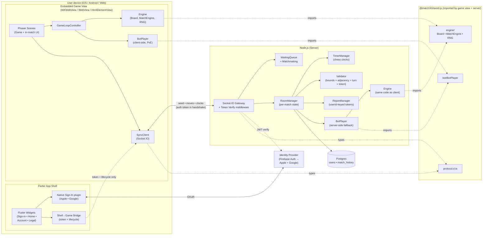
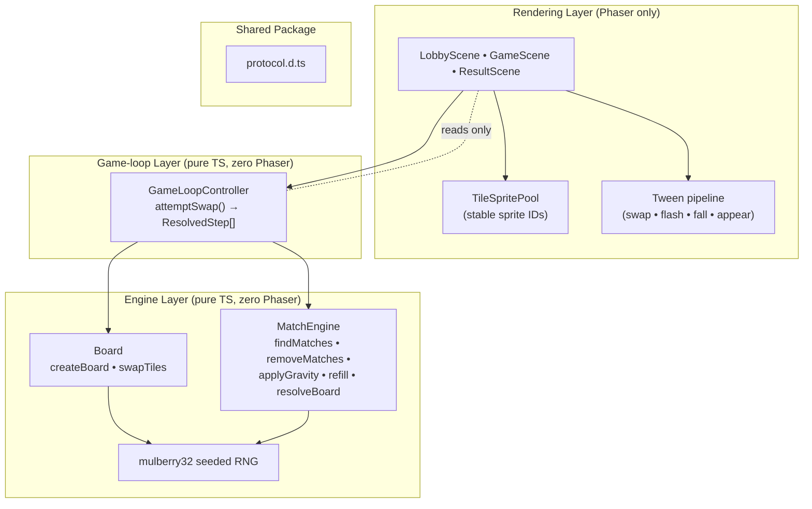
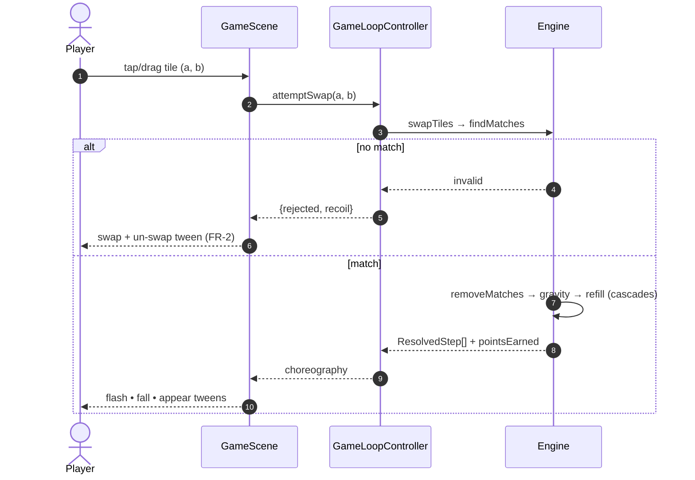
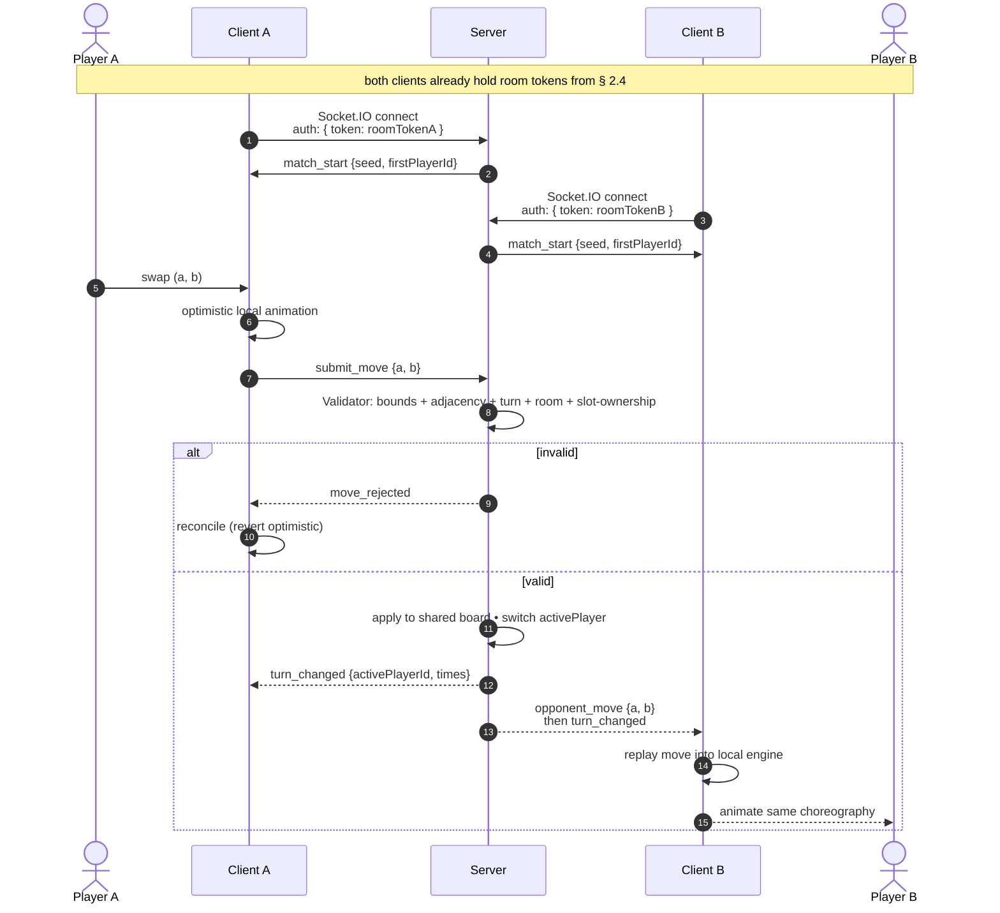
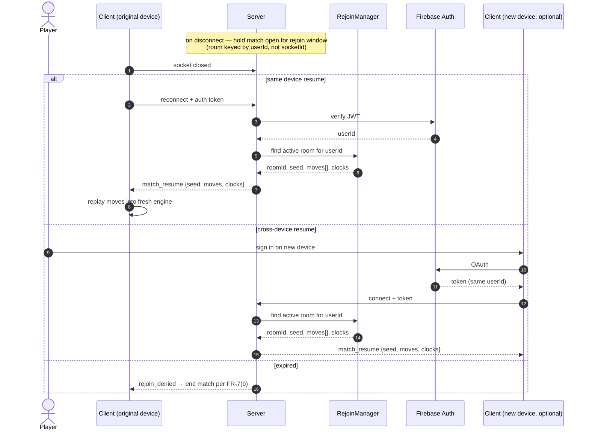
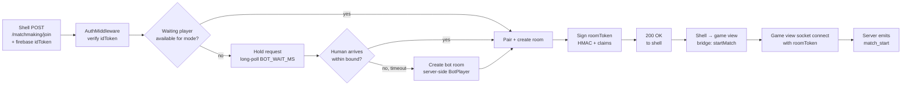
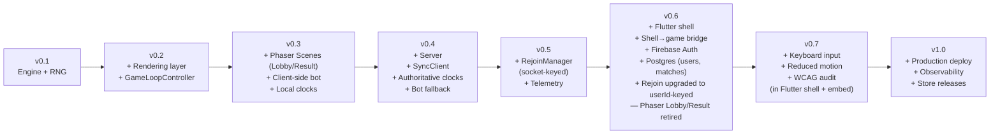
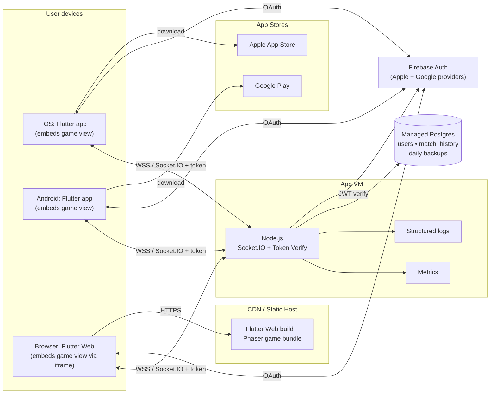

# System Design

Companion to [planning.md](planning.md) and [requirement.md](requirement.md). This document turns the milestone plan into a concrete architecture: component boundaries, data flow across the wire, and deployment shape. Diagrams are authored in Mermaid so they render directly on GitHub and in most Markdown viewers.

- **Scope.** Logical architecture of the Flutter app shell, the embedded game view, the server, the identity provider, and the shared TypeScript imported by both client and server. Runtime data flow for the three gameplay modes ([FR-5](requirement.md#1-functional-requirements--gameplay--modes)) plus sign-in and cross-device rejoin. Deployment topology for v1.0.
- **Non-scope.** Tile art specification, DevOps runbooks, localisation, push/IAP (the shell has the plumbing but not the features, per [planning.md § 6](planning.md#6-what-this-plan-does-not-cover)).

---

## 1. Architectural principles

These principles derive from the plan's guiding rules ([planning.md § 1](planning.md#1-guiding-principles)) and drive every layering decision below.

| Principle | Architectural consequence |
|---|---|
| Determinism before network ([NFR-5](requirement.md#determinism), [MR-2](requirement.md#2-multiplayer--networking-requirements)) | Engine is a pure library with zero framework/Node/Phaser imports. All randomness flows through one seeded RNG. Engine is unit-testable headlessly. |
| Bot before human | Bot AI is a pure function over board state, shared between the client (PvE) and the server (matchmaking fallback). The online flow is a transport swap over the same turn loop, not a re-implementation. |
| Ship playable slices | Every version after v0.1 boots a real UI. No "infrastructure-only" releases means no long-lived hidden branches. |
| Accessibility is not a bolt-on ([NFR-7](requirement.md#accessibility), [NFR-8](requirement.md#accessibility)) | Tile identity is encoded as shape + colour from v0.2. Input is abstracted behind a device-agnostic interface so keyboard support in v0.6 is additive. |
| Minimal wire protocol ([MR-3](requirement.md#2-multiplayer--networking-requirements), [MR-8](requirement.md#2-multiplayer--networking-requirements)) | The server relays seed + moves + clocks only. Full-state messages exist solely for the rejoin path ([MR-6](requirement.md#2-multiplayer--networking-requirements)). Board snapshots never appear in the hot path. |
| Identity at the shell, not in the game ([AR-1](requirement.md#3-identity--account-requirements), [AR-3](requirement.md#3-identity--account-requirements)) | The Flutter shell owns sign-in and token refresh. The game view owns the Socket.IO connection. The shell→game bridge carries only the token and platform lifecycle events — never gameplay data. This keeps the latency-sensitive loop inside one process and keeps the determinism boundary unchanged across the shell introduction. |
| Shell replaces, does not augment | The Flutter universal shell is the only distribution from v0.6 onward. There is no parallel raw-HTML deployment. This is why all user-facing UI (lobby, result, accounts) lives in Flutter Widgets, and the embedded game view is reduced to the in-match scene. |

---

## 2. High-level architecture

Three processes: the Flutter app shell (on the user's device), the Node.js server, and the identity provider. The shell embeds the Phaser game view. The game view talks to the server over Socket.IO. Both game view and server import the same deterministic engine from a shared TypeScript package.



Two things to notice in this picture:

1. **The hot path (moves, clocks, cascades) does not cross the shell→game bridge.** The shell passes the auth token in once, and the game view owns the socket. Every millisecond of the gameplay loop stays inside the WebView/iframe process. This preserves [NFR-2](requirement.md#performance) and [NFR-3](requirement.md#performance) from the pre-shell architecture with no regression.
2. **The shared engine is still the determinism keystone.** Adding the shell changed the distribution model but not the engine's location or its import graph. The same `@match3/shared-js` package still serves both game view and server, so [MR-2 / NFR-6](requirement.md#determinism) remain compile-time properties.

### 2.1 Client shell and embedded game view

The shell and the game view run in the same process but in different contexts. One Flutter codebase targets three platforms; the embedding mechanism is platform-specific, but the bridge contract is uniform.

| Target | Shell runtime | Embedding mechanism | Bridge transport |
|---|---|---|---|
| iOS | Flutter (Dart) compiled to native | `WKWebView` via [`webview_flutter`](https://pub.dev/packages/webview_flutter) | `JavaScriptChannel` |
| Android | Flutter (Dart) compiled to native | Platform `WebView` via `webview_flutter` | `JavaScriptChannel` |
| Flutter Web | Flutter (Dart) compiled to JS + CanvasKit | `HtmlElementView` + `<iframe>` | `window.postMessage` |

Responsibilities split cleanly:

- **Shell owns:** sign-in UI, token acquisition, token refresh, account deletion UI, privacy/ToS screens, lobby/home screen, result screen, platform lifecycle detection (foreground, background, pause, resume), deep-link handling.
- **Game view owns:** the Phaser rendering layer, `GameLoopController`, the engine, and the Socket.IO connection end-to-end. Authenticates its handshake with the token the shell hands it.

The reason for this split: the latency-sensitive loop ([NFR-2](requirement.md#performance), [NFR-3](requirement.md#performance)) must not cross a platform channel. Everything else is a good fit for native Flutter Widgets — they render faster, have better platform affordances (native sign-in sheet, pull-to-refresh, safe-area insets), and are where App Store guideline 4.2 ("Minimum Functionality") is satisfied.

### 2.2 Shell→game bridge contract

The bridge is deliberately tiny. If a new feature wants to add a gameplay-adjacent event to the bridge, it is almost certainly the wrong design — look for a way to route it through the server instead.

**Shell → game (shell-initiated):**
- `startMatch(roomToken: string, expiresAt: number)` — called after the shell has obtained a room-scoped token from the matchmaking endpoint (§ 2.4). Game view stores the token and connects the Socket.IO handshake with it. The token itself carries `{roomId, userId, slot, seed, exp}` — the game view treats it as opaque, just attaches it to the handshake.
- `appLifecycle(state: "foreground" | "background" | "pause" | "resume")` — allows the game view to pause animations and timers during background, and to trigger a reconnect probe on resume.
- `requestLeaveMatch()` — user tapped "leave match" in the shell UI; game view should gracefully end the current match.

**Game → shell (game-initiated):**
- `matchEnded(outcome: "W" | "L" | "D", scores: {self: number, opponent: number})` — shell shows the result screen in native Widgets and a "play again" button.
- `authTokenRejected()` — server rejected the room token (usually TTL-expired on a long match); shell re-requests a room token via the matchmaking endpoint's rejoin path and calls `startMatch` again.
- `ready()` — game view has loaded and is ready to receive the first `startMatch` call.

**Explicitly NOT on the bridge:** moves, clock ticks, opponent state, cascade events, scores during play, seed (it's inside the room token), room id (also inside the token). All of that stays inside the game view's socket. The **Firebase idToken never crosses the bridge** — the shell uses it to authenticate matchmaking HTTP calls; the game view only ever sees the server-issued room token.

### 2.3 Identity data flow

Two distinct tokens, two distinct roles. The **Firebase idToken** proves who the user is and never leaves the shell. The **room token** proves this user is entitled to a specific match and is the only credential the game view ever sees.

- **Firebase idToken** — issued by Firebase Auth after Apple/Google OAuth. Long-lived (1 h). Carries `{userId, email, claims}`. Used by the shell to authenticate HTTP calls to the matchmaking endpoint. Server verifies it via `firebase-admin.verifyIdToken()`.
- **Room token** — issued by *our server* after matchmaking succeeds. Short-lived (5 min, covers a match + slack). Carries `{roomId, userId, slot, seed, exp}`. Signed with a server-side HMAC secret. Used by the game view for the Socket.IO handshake. Server verifies it with a local HMAC check (no Firebase call per event).

```mermaid
sequenceDiagram
    autonumber
    actor U as User
    participant Shell as Flutter Shell
    participant IdP as Firebase Auth
    participant GV as Game View
    participant S as Server
    U->>Shell: tap "Sign in with Apple"
    Shell->>IdP: OAuth via native plugin
    IdP-->>Shell: id_token + userId
    Note over Shell: idToken stays on shell;<br/>never crosses the bridge
    U->>Shell: tap "Find match"
    Shell->>S: POST /matchmaking/join<br/>Authorization: Bearer idToken
    S->>IdP: verify idToken
    IdP-->>S: valid (userId)
    S->>S: enqueue in WaitingQueue<br/>(long-poll up to BOT_WAIT_MS)
    S->>S: match found → create room<br/>sign roomToken {roomId, userId, slot, seed, exp}
    S-->>Shell: 200 { roomToken, expiresAt }
    Shell->>GV: bridge: startMatch(roomToken, expiresAt)
    GV->>S: Socket.IO connect<br/>auth: { token: roomToken }
    S->>S: verify HMAC locally → decode {roomId, slot}
    S->>GV: place in room<br/>emit match_start {seed, firstPlayerId}
    Note over Shell,GV: Later — room token nears expiry during a long match
    GV->>S: next move (stale token)
    S-->>GV: auth_token_rejected
    GV->>Shell: bridge: authTokenRejected()
    Shell->>S: POST /matchmaking/resume<br/>Authorization: Bearer idToken<br/>body: { roomId }
    S-->>Shell: 200 { roomToken, expiresAt } (new)
    Shell->>GV: bridge: startMatch(roomToken, expiresAt)
    GV->>S: reconnect with fresh room token
```

The "token refresh while connected" flow is the subtle part and is explicitly tested in v0.6 — if it is broken, long matches drop on the token TTL boundary. Critically, refreshing the Firebase idToken (shell-internal, automatic) does NOT trigger a new `startMatch` — the room token is independent of idToken expiry.

### 2.4 Matchmaking endpoint

A small HTTP surface on the same Node server that owns the Socket.IO gameplay. Kept separate from the socket because (a) matchmaking is request/response, not streaming, and (b) the shell should not need a persistent socket just to find a game.

**`POST /matchmaking/join`**
- Auth: `Authorization: Bearer <firebaseIdToken>`
- Body: `{ mode: "turn_based" | "pve" | "solo" }`
- Behaviour: long-poll up to `BOT_WAIT_MS` (5 s). If a human is waiting for the same mode, pair them. Otherwise fall back to a bot room. In either case, create the room, sign a room token, and return.
- Response (200): `{ roomToken: string, expiresAt: number, mode, opponent?: { displayName } }`
- Errors: 401 invalid/missing idToken; 409 user already in an active match (AR-7); 503 shutdown draining.

**`POST /matchmaking/resume`**
- Auth: `Authorization: Bearer <firebaseIdToken>`
- Body: `{ roomId: string }`
- Behaviour: if the caller's userId matches a slot in an existing open room (inside the rejoin window per MR-6), sign a fresh room token for that room. Otherwise return 410 Gone so the shell knows to route to home.
- Response (200): `{ roomToken, expiresAt }`
- Errors: 401 invalid idToken; 403 userId not a slot in this room; 410 room closed/timed-out.

**Room token format** (opaque to the game view, structured for the server):
```
roomToken = HMAC-SHA256(secret, base64url(header) + "." + base64url(payload))
payload = { roomId, userId, slot: 0|1, seed, iat, exp }
```

TTL is 5 minutes by default — long enough for a normal match plus turn timers, short enough to bound damage if leaked. The token is bearer-style; possession of it = rights to the match slot. Leaks are mitigated by (a) TLS transport, (b) short TTL, (c) binding to a specific userId slot (a stolen token still can only play *as that user*, cannot steal identity).

---

## 3. Layered component view (embedded game view)

Inside the game view, four strict layers. Arrows only point down — upper layers depend on lower, never the reverse. This is what makes the engine unit-testable in Node and what keeps render code from accidentally mutating game state. The Flutter shell (§ 2.1) sits above this stack; it does not appear in the diagram because it talks to the game view only through the bridge (§ 2.2).



**Why the separation.** `GameLoopController` owns the tile-ID grid (`idAt`) and the choreography data (`ResolvedStep[]`). `GameScene` reads that choreography and drives tweens; it never mutates the board. That one-way contract is what lets the animation code be rewritten without touching game logic, and it's what makes v0.2 (rendered practice) a pure additive layer on top of v0.1 (headless engine).

**v0.6 evolution.** From v0.6 onward the rendering layer contains `GameScene` only. `LobbyScene` and `ResultScene` are reimplemented as Flutter Widgets in the shell (with native sign-in, platform-affinity styling, and account deletion UI hanging off the same screens). The in-match scene inside the game view stays exactly where it is, for the [NFR-2](requirement.md#performance) reasons in § 2.1.

---

## 4. Runtime data flow

### 4.1 Local move (Practice / PvE)

No network involvement. The scene is the I/O driver; the controller runs the engine synchronously and returns a choreography plan; the scene animates it.



### 4.2 Online move (vs Human) — the transport change from v0.3 → v0.4

Local move UX is unchanged; only the submit-and-confirm edges differ. The server is authoritative for turn order ([MR-4](requirement.md#2-multiplayer--networking-requirements)) and clocks ([MR-5](requirement.md#2-multiplayer--networking-requirements)); it relays a validated move to both clients so each replays it into its local engine.

From v0.6 onward, by the time either client's socket connects it already carries a room token that names its `roomId` and `slot`. The server decodes the token at handshake and places the socket in its room atomically — there is no client-side `join_queue` event. The game view's first observable socket message is `match_start` for its room.



Key property: the wire carries `(a, b) + metadata` only. Both clients reach cell-identical state because they run the same engine on the same seed with the same ordered moves — which is exactly what [NFR-6](requirement.md#determinism) requires.

### 4.3 Reconnection (v0.5, [MR-6](requirement.md#2-multiplayer--networking-requirements))

The rejoin path is the one place full-state crosses the wire, and only to one recipient. From v0.6, rejoin keys are bound to the authenticated user id rather than the socket id, which means a player may resume from a different device (e.g. phone → laptop) provided both sessions hold a valid auth token for the same account and the reconnection window ([MR-6](requirement.md#2-multiplayer--networking-requirements)) has not elapsed.



The v0.5 rejoin implementation used an HMAC token keyed by `(roomId, socketId, expiry)` — fine for tab-refresh recovery, useless for device-switching because a new device has a new socket id. The v0.6 upgrade replaces that with "room is keyed by authenticated userId; rejoin is whoever presents a valid token for that userId within the window." The HMAC disappears because auth-token verification already provides the hijack resistance it gave.

### 4.4 Matchmaking with bot fallback ([MR-1](requirement.md#2-multiplayer--networking-requirements))

From v0.6, matchmaking is an HTTP request/response against `/matchmaking/join` (§ 2.4) rather than a socket event. Waiting happens inside the server holding the request open; the shell sees a single synchronous answer containing a signed room token.



The bot fallback reuses the same `RoomManager` pipeline as a human match. From the client's perspective the two flows are indistinguishable — which is exactly why v0.3 (local bot) generalises cleanly to v0.4 (server with bot fallback). The shell receives the same `roomToken` shape regardless of opponent type.

---

## 4.5 Characters, skills, progression (v0.8)

Characters introduce per-player base stats and a skill system on top of the existing tile-effect engine. The architecture extends the existing pattern (server-authoritative for `turn_based`; client-deterministic-with-server-relay for pve) — no new processes.

```
shared-js/
  character/
    CharacterDef.ts   — CharacterDef + Skill + SkillEffect (discriminated union of stat-change /
                         activate-tiles / move-tiles primitives) + AmountExpr + TileSelector. Pure types.
    cat.ts            — first concrete character ("scratch", "strong bite", "board strike"),
                         expressed as effect lists.
    registry.ts       — id → CharacterDef map; iteration order is stable.
  engine/
    PlayerStats.ts    — extended: scaledStats(base, level), levelFromXp(xp), xpToNext(level)
    MatchEngine.ts    — extended: returns extraTurnsFromMatch4Plus per cascade step

apps/backend/
  persistence/UserProgressStore.ts   — read/write (userId, xp, defaultCharacterId)
  services/MatchEngineService.ts     — accepts characterId per slot at startMatch;
                                        applies skills (consume mana, deal damage, heal);
                                        suppresses turn switch when extraTurns > 0;
                                        awards XP at match-end and emits level_up mid-match.
  handlers/skill.ts                  — socket.on("skill", { skillId, target })
```

### 4.5.1 Wire additions

- `MatchFoundPayload` carries `characters: { [playerId]: characterId }` so each client renders the right portrait + skill set.
- `move_resolved` and `turn_changed` extend with `extraTurnsRemaining: number` (the active player's cumulative pending extra turns from 4+ matches; turn does not switch while > 0).
- New event `skill_resolved { playerId, skillId, damageDealt, healedAmount, activatedCells, playerStates }` — broadcast to room when a skill resolves.
- New event `level_up { playerId, newLevel, playerStates }` — broadcast when an XP grant crosses a threshold mid-match.
- New event `xp_awarded { playerId, xpDelta, newXp, newLevel }` — emitted alongside `match_ended`.

### 4.5.2 Authority and determinism

Skill damage and stat scaling MUST be computed server-side for `turn_based` and `pve` (whose end-of-match flow already routes through `match_complete`). Solo can compute locally since there's no opposing player. The 4+-line "extra turn" rule is a pure function of the cascade step's matched cells; clients and server compute it identically from the engine's match output. Mid-match level-ups are a deterministic function of (current xp + xp-from-this-match) crossing a threshold; the server is the announcer to keep both clients in sync.

### 4.5.3 Persistence

A new table `user_progress (user_id PK, xp INT NOT NULL DEFAULT 0, default_character_id TEXT NOT NULL, updated_at TIMESTAMPTZ)` is added to Postgres. The account-deletion sweep (AR-4) MUST drop the corresponding row. Match-history rows are unchanged — XP earned per match is reconstructable from the score column if ever needed for audit.

---

## 5. Mapping to the milestone plan

Each version in [planning.md § 2](planning.md#2-milestones--per-version-scope) corresponds to a specific subset of this architecture. No component comes online before its version; nothing lingers half-built.



| Version | New components introduced | Requirements satisfied |
|---|---|---|
| v0.1 | `shared/engine/` (Board, MatchEngine, RNG) | FR-1, FR-3, FR-4, NFR-5, NFR-6 |
| v0.2 | `fe/scenes/GameScene` (solo), `fe/game/GameLoopController`, `fe/rendering/TileSpritePool` | FR-2, FR-5 (Practice), NFR-1, NFR-2, NFR-7, NFR-8 (mouse/touch) |
| v0.3 | `fe/scenes/LobbyScene`, `fe/scenes/ResultScene`, `shared/bot/BotPlayer`, local `TimerManager` | FR-5 (vs Bot), FR-6, FR-7 |
| v0.4 | `be/server`, `be/RoomManager`, `be/WaitingQueue`, `be/Validator`, `be/TimerManager`, `be/BotManager`, `fe/net/SyncClient`, `shared/protocol.d.ts` | FR-5 (vs Human), FR-8, MR-1–5, MR-7, MR-8 |
| v0.5 | `be/RejoinManager` (socket-keyed), latency harness, lifecycle logging | MR-6 (initial), NFR-3, NFR-4 |
| v0.6 | `apps/frontend/` Flutter project (iOS + Android + Web targets), shell→game bridge, Firebase Auth integration, `be/AuthMiddleware` (JWT verify), Postgres + migrations (`users`, `match_history`), `RejoinManager` upgraded to userId-keyed. Phaser Lobby/Result scenes removed (replaced by Flutter Widgets). | AR-1–AR-7, NFR-11 (extended), MR-6 (upgraded) |
| v0.7 | Keyboard input adapter (shell + bridged into game view), `prefers-reduced-motion` handling in both, contrast audit | NFR-8 (keyboard), NFR-9, NFR-10, NFR-11 (formal), NFR-12 |
| v1.0 | Hosting + CDN + TLS + managed Postgres + metrics + App Store / Play Store production releases | — (infra + store) |

---

## 6. Deployment topology (v1.0)

Three delivery paths (web, iOS, Android) share one server + one identity provider + one database. A single small VM with a managed Postgres can carry the closed beta per [planning.md § 4.5](planning.md#45-non-engineering-support). Splitting static delivery from the realtime server is straightforward because the game view has no build-time dependency on the server origin beyond a Socket.IO URL.



**Scaling notes.** With determinism and a tiny wire protocol, one process comfortably holds the closed-beta target. Horizontal scaling, when needed, is a sticky-session or room-affinity routing problem — not a state-sync problem, because each room is self-contained in memory and can be reconstructed from its seed + move log.

**Durable-state notes.** Identity and match history are the only durable data. `users` is tiny (one row per sign-in). `match_history` grows linearly with match completion — a few rows per player per session, each well under a kilobyte. A weekly backup + point-in-time recovery for the last 7 days is sufficient. No replication required for the closed beta.

**Store distribution.** Mobile builds ship as signed IPA / AAB through the App Store and Play Store. The embedded Phaser bundle is packaged inside the app (no remote load of the game view on mobile, to sidestep App Store Guideline 4.2 risk). Flutter Web serves the game view from the same origin as the shell.

---

## 7. Technology stack

| Layer | Choice | Why |
|---|---|---|
| App shell | Flutter + Dart (stable channel) | Single codebase for iOS, Android, and Web. Native sign-in plugins mature. `webview_flutter` + `HtmlElementView` cover all three embedding targets. |
| Embedded game view | Phaser 3.88 + TypeScript 5.8 + Vite 6 | Unchanged from pre-shell era. The Phaser build is packaged into the Flutter app (mobile) or served same-origin (Web). |
| Shared engine | Pure TypeScript (no deps) | Imported by game view and server; satisfies [NFR-5](requirement.md#determinism) by construction. Unchanged by the shell introduction. |
| Backend | Node.js + Socket.IO 4.7 | Same language as game view → one engine, zero porting. Socket.IO handles reconnection plumbing that [MR-6](requirement.md#2-multiplayer--networking-requirements) needs. |
| Identity | Firebase Auth (Apple + Google providers) | Handles OAuth, token issuance, and token verification. Covers both providers required by [AR-2](requirement.md#3-identity--account-requirements). Free tier is generous enough for closed beta and early launch. |
| Persistence | Managed Postgres (production); SQLite acceptable for closed beta | Users + match history are small, well-structured, relational. No document-store fit. |
| Tests | Vitest (fe + be); Flutter `flutter_test` (shell) | Node-runnable engine tests; widget-level shell tests; integration test for the bridge contract. |

---

## 8. Cross-cutting concerns

**Determinism checks.** Two independent unit tests guard [NFR-5/NFR-6](requirement.md#determinism): a seeded-RNG byte-equality test, and a move-replay test that asserts two engines given the same seed + move list produce the same final board. The latter also runs end-to-end in v0.4 across two browser instances, and is re-run in v0.6 across iOS WebView + Android WebView + Flutter Web to confirm the shell change preserves the invariant.

**Bandwidth budget ([MR-8](requirement.md#2-multiplayer--networking-requirements)).** A move message is ≲ 40 bytes including Socket.IO framing. A 5-minute match with ~2 moves/sec and one clock tick/sec is on the order of a few kilobytes. Snapshots are off the hot path, so there is no regression surface beyond "accidentally add a new event in the move flow." The bridge contract (§ 2.2) deliberately excludes gameplay events so the shell cannot silently widen this surface.

**Cold-load budget ([NFR-12](requirement.md#platform--access)).** Flutter Web introduces CanvasKit (~1.5 MB) before the Phaser bundle even loads. v0.6 measures cold-load on a cold cache from a median residential connection and compares against the ~20 s first-launch / ~10 s returning-launch targets. If CanvasKit breaks budget, the fallback is the HTML renderer (smaller, slower) or deferring CanvasKit load until after the lobby paints.

**Failure modes.**
- *Client crash mid-move* — state is recoverable because the server holds the authoritative move log; reconnect replays it.
- *Shell crash with game view alive* — platform-specific; on Flutter Web the iframe survives the outer app crash briefly. The game view detects the broken bridge and pauses; on reconnect, the shell re-issues `setAuthToken` and play continues.
- *Token refresh miss* — the most subtle v0.6 failure. If the shell fails to push a refreshed token before the previous one expires, the next socket event is rejected. Covered by the `authTokenRejected` → shell refresh → `setAuthToken` cycle in § 2.3, with an integration test.
- *Server crash* — live match ends per [FR-7(b)](requirement.md#1-functional-requirements--gameplay--modes). Completed-match rows in Postgres survive. Persistent-match recovery across server restarts is out of scope (too much complexity for the short-match product shape).
- *Database outage* — sign-in still works (Firebase Auth is separate); matchmaking still works; match-end writes are buffered in memory until DB recovers (bounded queue; drop oldest on overflow with a metric).
- *Determinism divergence* — treated as a critical bug per [NFR-6](requirement.md#determinism). The two-browser assertion in v0.4 is the guardrail, extended in v0.6 to the three-target assertion.

**Security posture.**
- **Authenticated sessions.** Every Socket.IO handshake carries an id_token verified against Firebase Auth ([AR-3](requirement.md#3-identity--account-requirements), [MR-7](requirement.md#2-multiplayer--networking-requirements)). Unverified sockets never reach matchmaking.
- **Move validation.** Unchanged from v0.4: bounds + adjacency + turn ownership + room membership. Now includes "token userId matches the player slot in the room."
- **Rejoin hijack.** v0.5's HMAC-based rejoin token is retired in v0.6. Rejoin authority derives from presenting a valid auth token for the userId that owns the room — simpler, stronger, and requires no extra shared secret.
- **Data minimisation.** Only the sign-in provider's user id, display name, and avatar URL are stored server-side. No email addresses are stored unless the provider returns them as a required claim. Match history stores user ids, not names.
- **Deletion integrity ([AR-4](requirement.md#3-identity--account-requirements)).** Account deletion removes the `users` row and replaces the userId in all `match_history` rows with a tombstone identifier so the opponent's history remains self-consistent. Covered by an integration test.

**Privacy & compliance.** A privacy policy and terms-of-service are reachable from the sign-in screen ([AR-5](requirement.md#3-identity--account-requirements)). Account deletion is in-app and reachable without contacting support, satisfying App Store Guideline 5.1.1(v). Sign-in providers are Apple + Google only; Apple Sign-In is required on iOS wherever Google is offered (Guideline 4.8).

---

## 9. Open questions (blocking pinning in [requirement.md § Open values](requirement.md#open-values))

These values shape architecture only when they move materially (e.g. a 16×16 grid changes sprite-pool sizing; a 30-minute clock changes timer-tick cadence). The suggested starts in requirement.md are safe for the current architecture; revisit if changed.

- Grid size & palette count — affects sprite pool presizing and tile-art deliverables.
- Per-player clock — affects reconnect-window ergonomics (window should be ≪ clock).
- Reconnection window — affects server memory residency per idle match; the v0.6 jump from 60 s to ~5 min raises per-room residency ~5×.
- Concurrent-match target — blocks v1.0 load-test design and VM sizing.
- Account deletion grace period (immediate vs 30-day soft-delete) — affects the [AR-4](requirement.md#3-identity--account-requirements) integration test and the shape of the tombstoning scheme.
- Minimum iOS / Android versions — affects Flutter plugin compatibility and QA matrix in v0.7.
- Identity provider choice (Firebase Auth is the suggested default) — if swapped for Auth0, Clerk, or a self-hosted JWT setup, the token-verification middleware and refresh flow (§ 2.3) change. The bridge contract (§ 2.2) does not.

---

## 10. Document status

Living document. Update when a component is added, moved between layers, or when a requirement changes in [requirement.md](requirement.md). Do not renumber existing sections; append deprecation notes instead.
